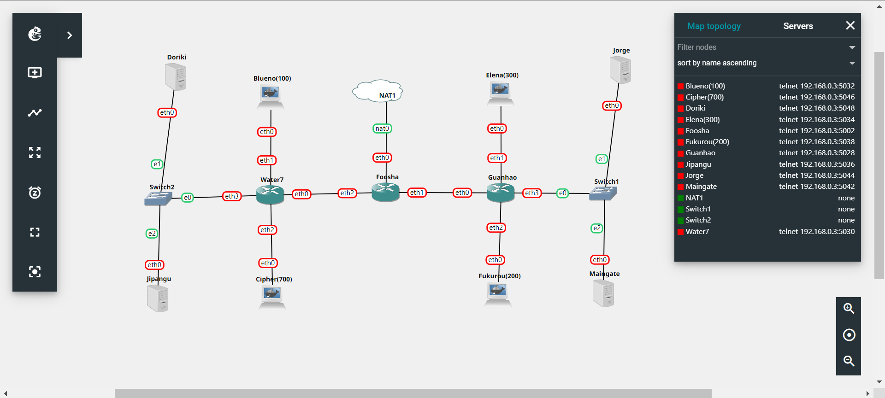
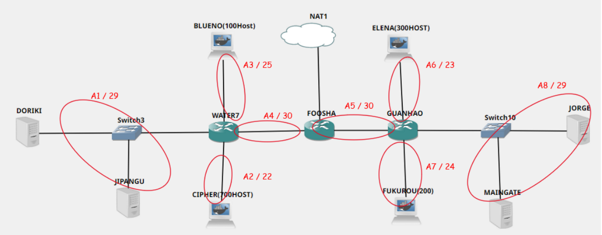
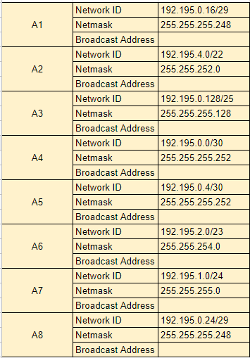
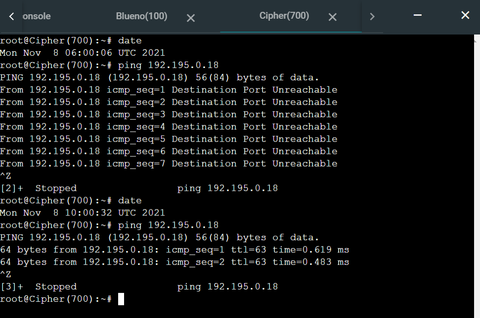
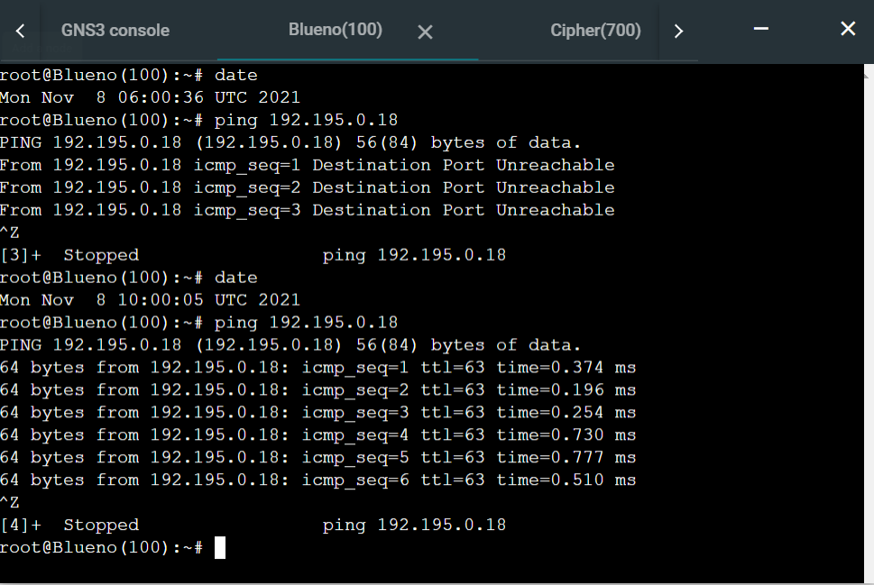
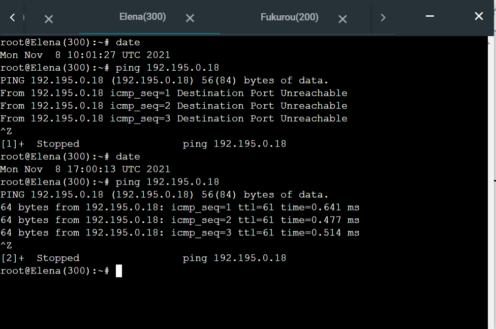
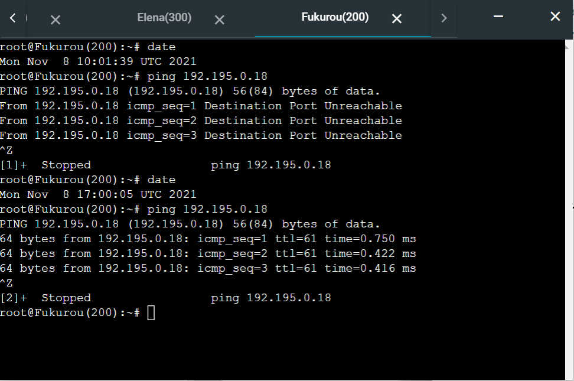

# Jarkom-Modul-5-D07-2021
### Anggota kelompok:
Anggota | NRP | 
------------- | ------------- | 
Amanda Rozi Kurnia | 05111940000094 | 
Dyandra Paramitha W. | 05111940000119 |
Daanii Nabil Ghinannafsi Kusnanta | 05111940000163 |


## Soal dan Pembahasan
### Persiapan
#### A

Soal : Tugas pertama kalian yaitu membuat topologi jaringan sesuai dengan rancangan yang diberikan Luffy dibawah ini

- Jipangu adalah DHCP Server
- Foosha, Water7, dan Guanhao adalah DHCP Relay
- Doriki adalah DNS Server
- Blueno, Cipher, Elena, dan Fukurou adalah client



#### B

Soal : Karena kalian telah belajar subnetting dan routing, Luffy ingin meminta kalian untuk membuat topologi tersebut menggunakan teknik CIDR atau VLSM.

#### Pembagian Subnet

Pembagian subnet menggunakan VLSM. Berdasarkan topologi yang telah dibuat, dapat ditentukan labelling netmask sebagai berikut



Berikut ini adalah jumlah ip untuk masing-masing subnet yang telah ditentukan.

| Subnet | Jumlah IP | Netmask |
| :----: | :-------: | :-----: |
|   A1   |     3     |   /29   |
|   A2   |    701    |   /22   |
|   A3   |    101    |   /25   |
|   A4   |     2     |   /30   |
|   A5   |     2     |   /30   |
|   A6   |    301    |   /23   |
|   A7   |    201    |   /24   |
|   A8   |     3     |   /29   |
|   TOTAL  |     1314     |   /21   |

Link perhitungan: <a href="https://docs.google.com/spreadsheets/d/1mJUFhs-Kh8UHh4d9NbaWPKwmRJN63QzTzxOjL84Yjg4/edit#gid=179543887">Perhitungan Modul 5</a>

### Pembagian IP
####  Tree


####  Tabel 




### C

Soal : Setelah melakukan subnetting, kalian juga diharuskan melakukan Routing agar setiap perangkat pada jaringan tersebut dapat terhubung.

Sebelum melakukan routing, membuat konfigurasi untuk masing-masing node pada `Configure > Edit Network Configuration`. Konfigurasi ini dilakukan supaya kita dapat mengetahui IP address dan gateway masing-masing node sehingga dapat saling dihubungkan saat membuat routing. Berikut adalah salah satu konfigurasi yang dilakukan, yaitu pada router Foosha

```
auto eth0
iface eth0 inet static
        address 192.168.122.2
        netmask 255.255.255.252
        gateway 192.168.122.1

auto eth1
iface eth1 inet static
	address 192.195.0.5
	netmask 255.255.255.252

auto eth2
iface eth2 inet static
	address 192.195.0.1
	netmask 255.255.255.252
```

Kemudian, Routing dilakukan antar router pada Foosha, Water7, dan Guanhao

- Foosha

```

route add -net 192.195.0.16 netmask 255.255.255.248 gateway 192.195.0.2
route add -net 192.195.0.128 netmask 255.255.255.128 gateway 192.195.0.2
route add -net 192.195.4.0 netmask 255.255.252.0 gateway 192.195.0.2
route add -net 192.195.0.24 netmask 255.255.255.248 gateway 192.195.0.6
route add -net 192.195.1.0 netmask 255.255.255.0 gateway 192.195.0.6
route add -net 192.195.2.0 netmask 255.255.255.0 gateway 192.195.0.6
```

- Water7

```
route add -net 0.0.0.0 netmask 0.0.0.0 gw 192.195.0.1
```

- Guanhao

```
route add -net 0.0.0.0 netmask 0.0.0.0 gw 192.195.0.5
```

### D

Soal : Tugas berikutnya adalah memberikan IP pada subnet Blueno, Cipher, Fukurou, dan Elena secara dinamis menggunakan bantuan DHCP server. Kemudian kalian ingat bahwa kalian harus setting DHCP Relay pada router yang menghubungkannya.

DHCP Server diletakkan pada Jipangu dengan file konfigurasi `/etc/dhcp/dhcpd.conf`sebagai berikut. Konfigurasi ini digunakan untuk memberikan IP address untuk masing-masing client.

```
subnet 192.195.0.128 netmask 255.255.255.128 {
    range 192.195.0.130 192.195.0.255;
    option routers 192.195.0.129;
    option broadcast-address 192.195.0.255;
    option domain-name-servers 192.195.0.18;
    default-lease-time 360;
    max-lease-time 7200;
}

subnet 192.195.0.16 netmask 255.255.255.248 {
}

subnet 192.195.4.0 netmask 255.255.252.0 {
    range 192.195.4.2 192.195.7.255;
    option routers 192.195.4.1;
    option broadcast-address 192.195.7.255;
    option domain-name-servers 192.195.0.18;
    default-lease-time 360;
    max-lease-time 7200;
}

subnet 192.195.2.0 netmask 255.255.254.0 {
    range 192.195.2.2 192.195.3.255;
    option routers 192.195.2.1;
    option broadcast-address 192.195.3.255;
    option domain-name-servers 192.195.0.18;
    default-lease-time 360;
    max-lease-time 7200;
}

subnet 192.195.1.0 netmask 255.255.255.0 {
    range 192.195.1.2 192.195.1.255;
    option routers 192.195.1.1;
    option broadcast-address 192.195.1.255;
    option domain-name-servers 192.195.0.18;
    default-lease-time 360;
    max-lease-time 7200;
}

```

Agar client dapat terhubung dengan internet, pada file konfigurasi `/etc/dhcp/dhcpd.conf` diarahkan menuju `eth0` yaitu interface yang mengarah ke router. Kemudian, menambahkan file konfigurasi `/etc/default/isc-dhcp-relay` untuk DHCP Relay pada router Water7, Foosha, dan Guanhao sebagai berikut

```
# What servers should the DHCP relay forward requests to?
SERVERS="192.195.0.19"

# On what interfaces should the DHCP relay (dhrelay) serve DHCP requests?
INTERFACES="eth0 eth1 eth2 eth3"

# Additional options that are passed to the DHCP relay daemon?
OPTIONS=""
```

IP `192.195.0.19` adalah IP Address dari DHCP Server yaitu Jipangu, lalu mengarahkan interface pada `eth0 eth1 eth2 eth3` supaya DHCP Relay dapat meneruskan DHCP request pada DHCP Server

### No 1
#### Soal

Agar topologi yang kalian buat dapat mengakses keluar, kalian diminta untuk mengkonfigurasi Foosha menggunakan iptables, tetapi Luffy tidak ingin menggunakan MASQUERADE.

#### Jawaban

Pada Foosha ditambahkan rule Iptables di bawah ini:

```bash
iptables -t nat -A POSTROUTING -s 192.195.0.0/21 -o eth0 -j SNAT --to-source 192.168.122.25
```

##### Keterangan: 

`-t nat`: Menggunakan tabel NAT karena akan mengubah alamat asal dari paket

`- A POSTROUTING`: Menggunakan chain POSTROUTING karena mengubah asal paket setelah routing

`- s 192.195.0.0/21`: Mendifinisikan alamat asal dari paket yaitu semua alamat IP dari subnet 192.195.0.0/21

`- o eth0` : Paket keluar dari eth0 Foosha

`- j SNAT`: Menggunakan target SNAT untuk mengubah source atau alamat asal dari paket

`--to-source 192.168.122.25`: Mendefinisikan IP source, di mana digunakan eth0 Foosha dengan rentang IP. 

Selain itu, agar klien dapat mengakses ke luar, maka perlu ditambahkan forwarding pada DNS Server yaitu **Doriki** pada file `/etc/bind/named.conf.options`, uncomment pada bagian (0.0.0.0 diubah menjadi 192.168.122.1):

```
forwarders {
    192.168.122.1;
};
```

Comment pada bagian ini

```
// dnssec-validation auto;
```

Dan tambahkan

```
allow-query{any;};
```

### No 2

#### Soal
Kalian diminta untuk mendrop semua akses HTTP dari luar Topologi kalian pada server yang merupakan DHCP Server dan DNS Server demi menjaga keamanan.

#### Jawaban
Pada Foosha ditambahkan rule Iptables di bawah ini:

```bash
iptables -A FORWARD -d 192.195.0.16/29 -i eth0 -p tcp --dport 80 -j DROP
```

##### Keterangan:

`-A FORWARD`: Menggunakan chain FORWARD

`- p tcp`: Mendefinisikan protokol yang digunakan, yaitu tcp

`- -dport 80`: Mendefinisikan port yang digunakan, yaitu 80 (HTTP)

`- d 192.195.0.16/29`: Mendefinisikan alamat tujuan dari paket (DHCP dan DNS SERVER ) berada pada subnet 192.195.0.16/29

`- i eth0`: Paket masuk dari eth0 Foosha

`- j DROP`: Paket di-drop


### No 3

#### Soal
Karena kelompok kalian maksimal terdiri dari 3 orang. Luffy meminta kalian untuk membatasi DHCP dan DNS Server hanya boleh menerima maksimal 3 koneksi ICMP secara bersamaan menggunakan iptables, selebihnya didrop.

#### Jawaban
Pada Jipangu dan Doriki ditambahkan rule iptables di bawah ini:

```bash
iptables -A INPUT -p icmp -m connlimit --connlimit-above 3 --connlimit-mask 0 -j DROP
```
##### Keterangan:

`-A INPUT`: Menggnakan chain INPUT

`- p icmp`: Mendefinisikan protokol yang digunakan, yaitu ICMP (ping)

`- m connlimit`: Menggunakan rule connection limit

`- -connlimit-above 3`: Limit yang ditangkap paket adalah di atas 3

`- -connlimit-mask 0` : Hanya memperbolehkan 3 koneksi setiap subnet dalam satu waktu

`- j DROP`: Paket di-drop

### No 4

#### Soal
Kemudian kalian diminta untuk membatasi akses ke Doriki yang berasal dari subnet Blueno, Cipher, Elena dan Fukuro dengan beraturan sebagai berikut
Akses dari subnet Blueno dan Cipher hanya diperbolehkan pada pukul 07.00 - 15.00 pada hari Senin sampai Kamis.

#### Jawaban
Pada Doriki ditambahkan rule Iptables di bawah ini:

```bash
## Batas Akses Doriki Dari Cipher

iptables -A INPUT -s 192.195.4.0/22 -d 192.195.0.16/29 -m time --timestart 07:00 --timestop 15:00 --weekdays Mon,Tue,Wed,Thu -j ACCEPT
iptables -A INPUT -s 192.195.4.0/22 -j REJECT

## Batas Akses Doriki Dari Blueno

iptables -A INPUT -s 192.195.0.128/25 -d 192.195.0.16/29 -m time --timestart 07:00 --timestop 15:00 --weekdays Mon,Tue,Wed,Thu -j ACCEPT
iptables -A INPUT -s 192.195.0.128/25 -j REJECT
```

##### Keterangan:

`-A INPUT` : Menggunakan chain INPUT

`-s 192.195.0.128/25` : Mendifinisikan alamat asal dari paket yaitu IP dari subnet Blueno

`-s 192.195.0.128/25` : Mendifinisikan alamat asal dari paket yaitu IP dari subnet Cipher

`-d 192.195.0.16/29` : Mendifinisikan alamat tujuan dari paket yaitu IP dari subnet Doriki

`-m time` : Menggunakan rule time

`--timestart 07:00` : Mendefinisikan waktu mulai yaitu 07:00

`- timestop 15:00`: : Mendefinisikan waktu berhenti yaitu 15:00

`- -weekdays Mon,Tue,Wed,Thu` : Mendefinisikan hari yaitu Senin hingga Kamis

`- j ACCEPT` : Paket di-accept

`- j REJECT` : Paket ditolak

#### Testing
dapat dites dengan melakukan ping dari Cipher/Blueno ke Doriki




### No 5
#### Soal
Akses dari subnet Elena dan Fukuro hanya diperbolehkan pada pukul 15.01 hingga pukul 06.59 setiap harinya.

#### Jawaban
Pada Doriki ditambahkan rule Iptables di bawah ini:

```bash
##Batas Akses Doriki Dari Elena

iptables -A INPUT -s 192.195.2.0/23 -m time --timestart 15:01 --timestop 06:59 -j ACCEPT
iptables -A INPUT -s 192.195.2.0/23 -j REJECT

##Batas Akses Doriki Dari Fukuro

iptables -A INPUT -s 192.195.1.0/24 -m time --timestart 15:01 --timestop 06:59 -j ACCEPT
iptables -A INPUT -s 192.195.1.0/24 -j REJECT
```

##### Keterangan
`-A INPUT` : Menggunakan chain INPUT

`-s 192.195.2.0/23` : Mendifinisikan alamat asal dari paket yaitu IP dari subnet Elena

`-s 192.195.1.0/24` : Mendifinisikan alamat asal dari paket yaitu IP dari subnet Fukuro

`-d 192.195.0.16/29` : Mendifinisikan alamat tujuan dari paket yaitu IP dari subnet Doriki

`-m time` : Menggunakan rule time

`--timestart 15:01` : Mendefinisikan waktu mulai yaitu 15:01

`- timestop 06:59`: : Mendefinisikan waktu berhenti yaitu 06:59


`- j ACCEPT` : Paket di-accept

`- j REJECT` : Paket ditolak

#### Testing
dapat dites dengan melakukan ping dari Elena/Fukurou ke Doriki





### No 6

#### Soal
Karena kita memiliki 2 Web Server, Luffy ingin Guanhao disetting sehingga setiap request dari client yang mengakses DNS Server akan didistribusikan secara bergantian pada Jorge dan Maingate

#### Jawaban
Ditambahkan perintah iptables sebagai berikut di Guanhao:

```
iptables -A PREROUTING -t nat -p tcp -d 10.18.4.128/29 --dport 80 -m statistic --mode nth --every 2 --packet 0 -j DNAT --to-destination  10.18.9.2:80
iptables -A PREROUTING -t nat -p tcp -d 10.18.4.128/29 --dport 80 -j DNAT --to-destination 10.18.9.3:80
iptables -t nat -A POSTROUTING -p tcp -d 10.18.9.2 --dport 80 -j SNAT --to-source 10.18.4.128:80
iptables -t nat -A POSTROUTING -p tcp -d 10.18.9.3 --dport 80 -j SNAT --to-source 10.18.4.128:80
```


